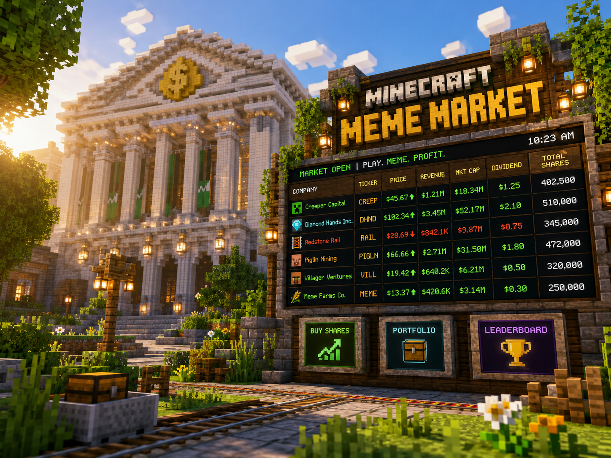
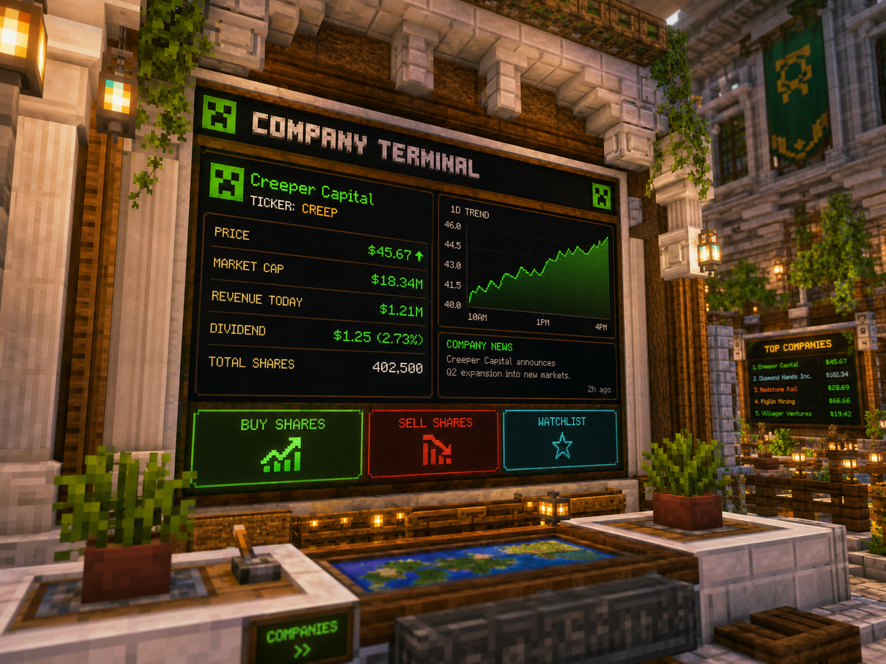
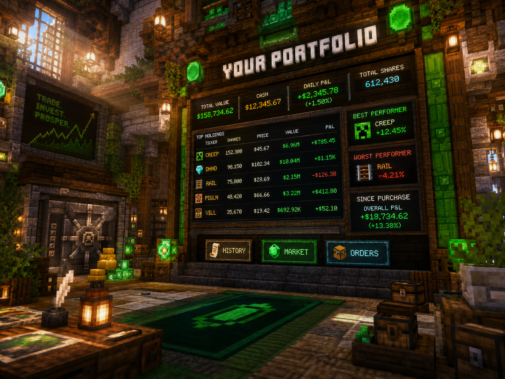
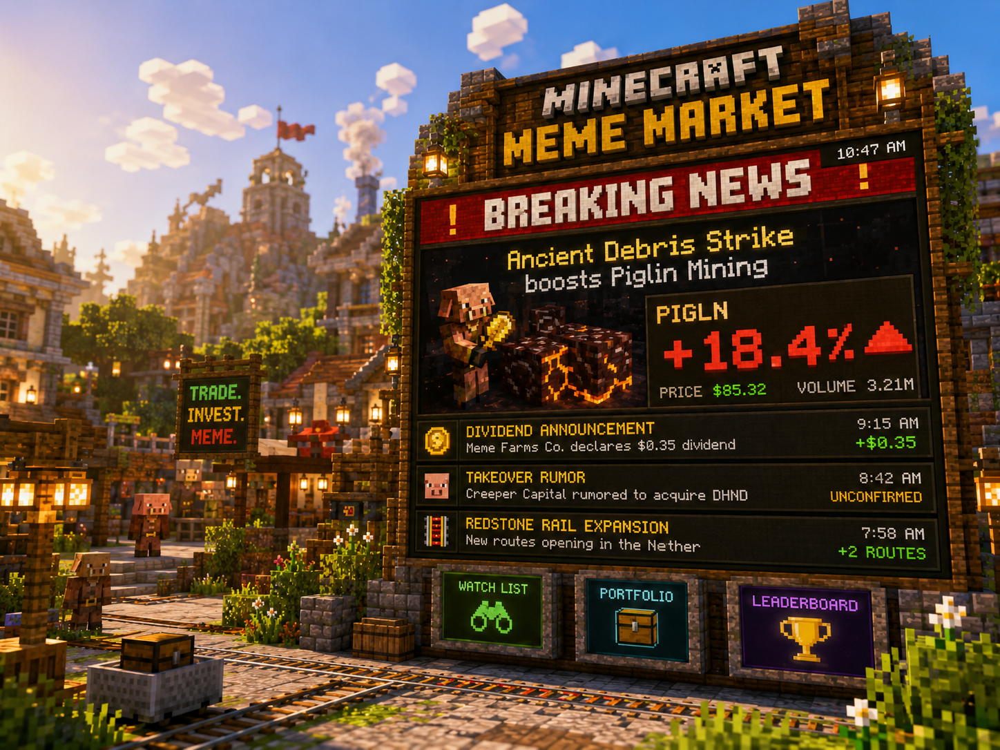
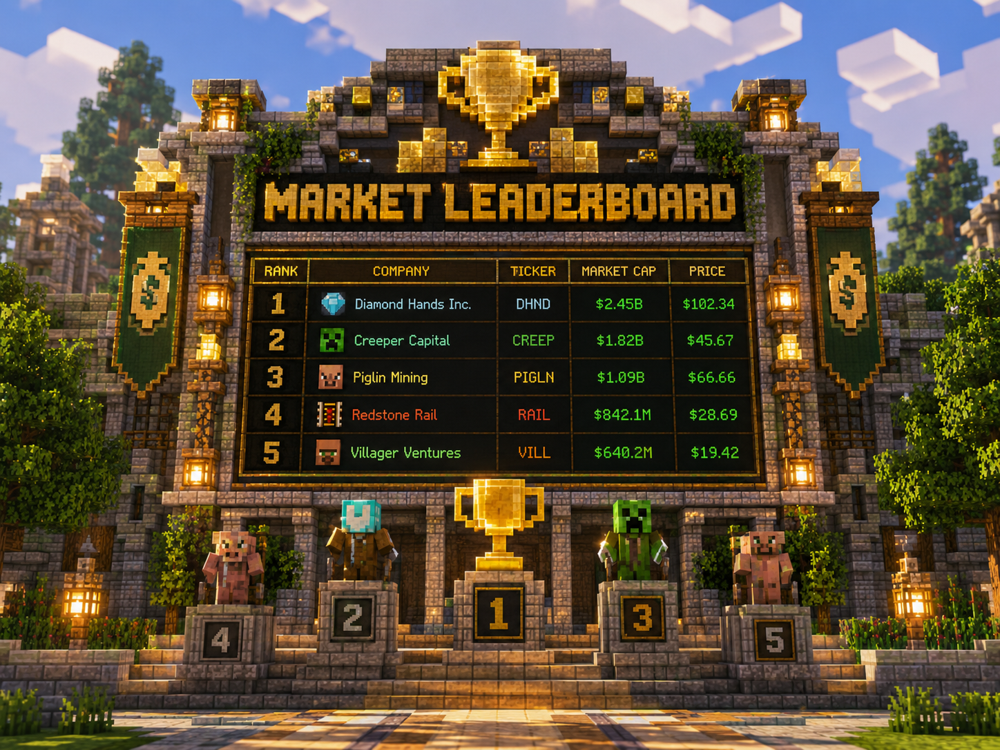

# Minecraft Meme Market

A multiplayer stock-market simulation for Minecraft servers: create companies, buy and sell shares, collect dividends, react to news, fight hostile takeovers, and watch meme-fuelled prices move in real time.

> **Status:** experimental side project / playable prototype. The project is intentionally built as a modular Paper plugin so individual systems can be expanded without rewriting the whole market loop.

## Showcase

### Live market board



### Company terminal



## What it does

Minecraft Meme Market turns a server economy into a live exchange. Players can found companies, issue shares, trade them with other players, earn dividends from company revenue, trigger market-moving news events, and attempt takeovers when they accumulate enough ownership.

Core systems included in this repository:

- Player-owned companies with CEO and treasury state
- Buy / sell trading with price impact
- Market-cap, float, company cash, revenue and dividend accounting
- Scheduled market ticks and configurable volatility
- Meme/news events that can temporarily influence demand
- Dividend distribution to shareholders
- Hostile-takeover checks and majority ownership detection
- Leaderboards for richest players and largest companies
- YAML persistence layer for fast prototyping
- Admin commands, permission nodes and configurable messages
- CI workflow, tests, issue templates and contributor docs

## Gameplay loop

```text
Player earns currency
      ↓
Buys shares / founds a company
      ↓
Company earns revenue
      ↓
News + trading volume move price
      ↓
Market tick recalculates valuation
      ↓
Dividends / takeovers / leaderboard changes
      ↓
More trading
```

## Example market board

```text
┌──────────────────────────────────────┐
│          MINECRAFT MEME MARKET       │
├──────────────────────────────────────┤
│ Company         Ticker     Price     │
│ Creeper Capital CREEP      $45.67    │
│ Diamond Hands   DHND       $102.34   │
│ Piglin Mining   PIGLN      $66.66    │
│ Redstone Rail   RAIL       $28.69    │
├──────────────────────────────────────┤
│ Market size: $118,700,000            │
│ Active companies: 18                 │
│ Market mood: GREED                   │
└──────────────────────────────────────┘
```

## Commands

| Command | Description |
|---|---|
| `/market` | Open the main market overview |
| `/market quote <ticker>` | Show a live company quote |
| `/market top` | Show the market-cap leaderboard |
| `/company create <name> <ticker>` | Create a new company |
| `/company info <ticker>` | Show company fundamentals |
| `/trade buy <ticker> <shares>` | Buy shares |
| `/trade sell <ticker> <shares>` | Sell shares |
| `/trade portfolio` | Show your holdings |
| `/marketadmin tick` | Force a market tick |
| `/marketadmin news <ticker> <impact>` | Inject a market-moving event |

Full reference: [`docs/commands.md`](docs/commands.md)

## Architecture

```text
Minecraft / Paper
      │
      ├── Commands & listeners
      │
      ├── MarketService
      │     ├── PriceEngine
      │     ├── DividendService
      │     ├── NewsService
      │     ├── TakeoverService
      │     └── LeaderboardService
      │
      ├── MarketRepository
      │     └── YAML persistence
      │
      └── MarketBoardRenderer
```

See [`docs/architecture.md`](docs/architecture.md) for the module breakdown.

## Quick start

### Requirements

- Java 21+
- Maven 3.9+
- Paper-compatible Minecraft server

### Build

```bash
mvn clean package
```

The plugin jar will be generated under `target/`.

### Install

1. Copy the jar into your server's `plugins/` directory.
2. Start the server once to generate configuration.
3. Edit `plugins/MinecraftMemeMarket/config.yml`.
4. Restart or reload the plugin.

## Configuration

The default configuration exposes market cadence, starting company values, price-impact sensitivity, dividend behavior, takeover thresholds and volatility.

```yaml
market:
  tick-seconds: 30
  base-volatility: 0.035
  max-price-change-per-tick: 0.20

companies:
  creation-cost: 2500
  default-total-shares: 100
  default-starting-price: 10.0

dividends:
  enabled: true
  minimum-payout: 1.0

takeovers:
  enabled: true
  control-threshold: 0.51
```

More: [`docs/configuration.md`](docs/configuration.md)

## Price model

The prototype uses a deliberately game-like pricing model rather than trying to reproduce a real exchange. Each tick combines:

- net buy/sell pressure
- random volatility
- company revenue momentum
- active news impact
- liquidity damping

The result is clamped to avoid a single tick instantly destroying a company. The formula and tuning notes are documented in [`docs/price-engine.md`](docs/price-engine.md).

## Dividends / Rewards

Companies can distribute a configurable fraction of available cash to shareholders. Payouts are proportional to ownership and are skipped if the treasury cannot cover the distribution.

## Hostile takeovers

When one player crosses the configured control threshold, the takeover service can transfer CEO control after a short confirmation window. Servers that want a less aggressive game can disable the feature entirely.

## Repository map

```text
.
├── .github/                 CI + issue templates
├── docs/                    architecture and feature docs
│   └── images/              README screenshots and assets
├── examples/                demo company and news data
├── scripts/                 development helpers
├── src/main/java/           plugin source
├── src/main/resources/      plugin.yml + configs
├── src/test/java/           unit tests
├── CHANGELOG.md
├── CONTRIBUTING.md
├── LICENSE
├── SECURITY.md
└── pom.xml
```

## Roadmap

- [x] Core company model
- [x] Basic buy/sell engine
- [x] Market ticks
- [x] Dividends
- [x] News impact
- [x] Majority-ownership takeover detection
- [x] YAML persistence layer
- [ ] Inventory GUI trading terminal
- [ ] Physical exchange-board renderer using maps / display entities
- [ ] Limit orders and order book
- [ ] IPO auctions
- [ ] Player-submitted company announcements
- [ ] Web dashboard / API
- [ ] Seasonal market resets

See [`docs/roadmap.md`](docs/roadmap.md) for the expanded roadmap.

## More screenshots

### Portfolio screen



### Breaking news board



### Market leaderboard



More screenshot notes: [`docs/screenshots.md`](docs/screenshots.md)

## Contributing

Pull requests are welcome. Please read [`CONTRIBUTING.md`](CONTRIBUTING.md) before opening a PR.

## License

MIT — see [`LICENSE`](LICENSE).
